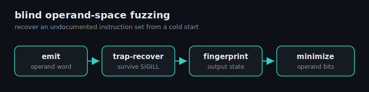

# amx-blind-fuzz

## In plain English

Apple's chips have a hidden, powerful "matrix engine" for fast math, but Apple
never published a manual for it, so there's no official way to know what its
instructions do. This project figures the engine out from scratch by trial and
error: throw a guessed instruction at it, catch the crash if the guess was
invalid, and carefully watch what the valid ones actually compute. It's like
mapping the buttons on an unlabeled remote by pressing each one and watching the
TV. Two useful takeaways: (1) the trial-and-error tool itself, which can map an
undocumented chip feature with zero prior knowledge, and (2) a practical finding
about when this engine is (and isn't) the right way to do fast 8-bit AI math.
(While cleaning this up, the same method caught a real sign-handling bug in our
own matrix-multiply demo and fixed it; see `RESULTS.md`.)

---

Black-box reverse-engineering of Apple's AMX matrix coprocessor by fuzzing its
undocumented instruction encodings, plus a practical int8 quantization analysis
and a constant-time audit. Apple M-series, tested on an M2.



## What this is, and what it is not

Apple's AMX is an undocumented matrix coprocessor in the M-series CPU clusters,
reachable from userspace by emitting raw instruction words. This repo recovers
AMX's integer and quantization instructions (MATINT, MAC16, GENLUT) from scratch
with a black-box fuzzer: it issues candidate operand encodings, recovers from
illegal-instruction traps, and fingerprints the resulting hardware behavior.

Scope, stated up front. The instruction encodings recovered here are
already documented by the [corsix/amx](https://github.com/corsix/amx) project,
which derived them through disassembly and targeted hardware tests. This work
arrives at the same map by a different route, blind operand-space fuzzing, so it
is best read as an independent reproduction and a reusable methodology rather
than a set of new discoveries. Where anything goes past the existing public
record it is called out explicitly below. The reusable parts are the fuzzer, the
practical int8 finding, and a small extension to the timing analysis.

## The method

The interesting artifact is the fuzzer, not the AMX-specific results.

1. Emit a candidate AMX instruction with a chosen 64-bit operand.
2. Survive invalid encodings: a `SIGILL` handler with `sigsetjmp`/`siglongjmp`
   lets one process test millions of operands without dying or forking per try.
3. Fingerprint behavior: run the instruction on known inputs, hash the full
   output-register state, and bucket distinct behaviors. This recovers what an
   operand does without any prior knowledge of the encoding.
4. Minimize: greedily clear operand bits while a target behavior survives, to
   isolate the essential bits of a mode from incidental ones.

This is enough to map an undocumented integer ISA from a cold start. The repo
includes a one-billion-operand behavioral census produced this way.

## Findings (each cross-checked against corsix)

| Area | What the fuzzer recovered | Status vs public record |
|---|---|---|
| MATINT int16 to int32 | operand selects 16-bit input with 32-bit accumulate; verified bit-exact 32x32 matmul vs a scalar reference | documented (corsix `matint.md`) |
| Operand signedness | one operand bit toggles Y signedness, a separate bit controls X | documented (corsix) |
| int8 input | an operand bit narrows the inputs to 8-bit | documented (corsix) |
| MAC16 | int16 multiply-accumulate into int16, wraps mod 2^16 (no saturation) | instruction documented; the wrap-vs-saturate detail is confirmed here |
| GENLUT | register-resident table lookup, writes X/Y/Z, no memory access | documented (corsix `genlut.md`) |
| Constant-time compute | no value-dependent timing across zero, sparse, large, and denormal operands, in fp and int | AMX data-independence already shown by the crypto work below; this adds an explicit denormal test and a GENLUT timing check |

## The int8 quantization result (the practical takeaway)

A common assumption is that AMX gives a fast int8 path for quantized inference.
It does not, cleanly. The int8 matrix modes that accumulate into 32 bits are
constrained (strided packing, or a broadcast dataflow that is not a general
outer product), and the clean int8 outer-product accumulates into 16 bits and
overflows after a few terms. The code shows both directly.

The real 4x for int8 on Apple Silicon comes from NEON's `SDOT` instruction
(int8 dot-product into int32), not from AMX. The benchmark here measures
**4.04x** over an fp32 NEON baseline at about 1.3% quantization error. The
division of labor: AMX is the right tool for fp32 and fp16 matrix work, NEON
SDOT is the right tool for int8.

## Constant-time audit

[THOR](https://arxiv.org/abs/2502.17658) recovers neural-network weight sparsity
from value-dependent multiply timing on **Intel** AMX. This repo runs the
equivalent check on **Apple** AMX and finds no such leak: FMA32 and MATINT timing
is constant to four decimal places across zero, sparse, large, denormal, and
infinity operands, both latency-bound and throughput-bound.

Prior work already established AMX data-independence in the crypto setting
([PQC-AMX, ePrint 2024/195](https://eprint.iacr.org/2024/195), and the companion
NTRU-on-M1/M3 paper in IACR CiC) using zero-versus-random equivalence testing.
This repo adds two things that work left open: an explicit denormal slow-path
test (denormals do not slow AMX, unlike most scalar and SIMD FPUs), and a timing
check of GENLUT, which the crypto work flagged as the one instruction it did not
verify.

## Layout

```
fuzz/        the blind fuzzer: opcode census, behavioral census, operand hunt
opmap/       operand maps + a bit-exact int16 to int32 matmul
int8/        why AMX int8 is constrained, and the NEON SDOT 4x benchmark
consttime/   value-independence audit (fp and int) and the GENLUT timing check
amx.h        hand-emitted raw AMX op encodings
```

## Build and run

```
clang -O2 -arch arm64 fuzz/opcode_census.c -o opcode_census && ./opcode_census
```

Each program is self-contained and prints its own result. Apple Silicon only.
Some timing tools pin to a performance core for stable numbers.

## Credit and prior work

The AMX encodings were first reverse-engineered and documented by Peter Cawley
([corsix/amx](https://github.com/corsix/amx)) and Dougall Johnson. The
constant-time picture for Apple AMX was first established by the PQC-AMX and
IACR CiC crypto authors. This repo reproduces the integer-instruction map by an
independent fuzzing method and extends the timing analysis at the margins. Any
errors here are mine.

## License

MIT.
